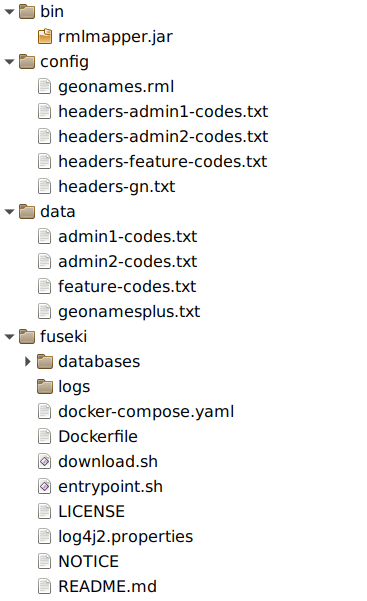

# Geonames-harvest

Simple download and transform scripts to download and convert geonames dumps into a basic RDF dataset. The result is loaded in a SPARQL endpoint for querying the data through the Network-of-Terms.

## Installation

### RML

The text to RDF transformation is done using the RML mapper. This requires a java runtime environment (openjdk or other). The RMLmapper can be downloaded from the the [RML repo](https://github.com/RMLio/rmlmapper-java). The scripts assume that the `rmlmapper.jar` is available in the `./bin` directory.

### Fuseki

The Geonames RDF is exposed through a Jena Fuseki based SPARQL endpoint. In this setup is choosen for the Fuseki docker server without UI. Download and extract the latest version of [the Jena Fuseki Docker](https://repo1.maven.org/maven2/org/apache/jena/jena-fuseki-docker/) zipfile and rename the new directory to `./fuseki`. Build the docker image using `docker-compose build --build-arg JENA_VERSION={latest version}`. Be sure to use a recent docker-compose version! Create an empty 'databases' and 'logs' dir before the first run. See the [Fuseki docs](https://jena.apache.org/documentation/fuseki2/fuseki-docker.html) for more information.

Afther cloning the repo and installing the additional tools described above, the subdirectories will look like this:

## Geonames download scripts

A number of `bash` scripts take care of the download, mapping and exposing the generated RDF through a SPARQL endpoint.  

These script also requires the `sed` en `awk` tools for preprocessing. These are avaible in standard Linux distro's.

See the [Geonames download website](https://download.geonames.org/export/dump/) for detailed information on the geonames dumpfiles. Currently only the **NL** and **BE** country dumpfiles are processed.

Run the scripts in the following order:

1. **Download**
Run the `geonames-download.sh` to download the data. Currently only the NL and BE country data is downloaded. After downloading some basic cleaning is done to prevent problems in the mapping proces. The download files are place in the `./data` directory.

2. **Mapping**
   Run the `map.sh` to convert the textfiles to RDF. The resulting ntriples files is placed in `./fuseki/databases/`. The mapping can take some time to finish, be patient!

3. **Expose the data**
   Run the `server.sh` to start the server and expose the SPARQL-endpoint on <http://localhost:3030/geonames/sparql>.
